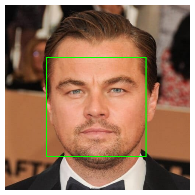
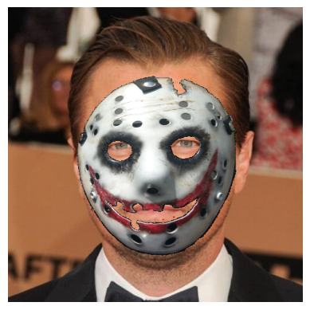

# Mini SnapChat : Augmented Reality Face Mask Application

This repository contains a project developed as part of the Computer Vision Graduate Course. The project demonstrates a simple implementation of an Augmented Reality (AR) application, akin to the Snapchat face filters, where a Joker mask is superimposed on faces detected in images. The project utilizes Python, OpenCV, and dlib libraries for face detection, facial landmark recognition, and image transformation.

## Table of Contents

- [Introduction](#introduction)
- [Features](#features)
- [Requirements](#requirements)
- [Results](#results)
- [References](#references)

## Introduction

This project aims to develop a basic AR application that detects faces in images and superimposes a Joker mask on them. The implementation involves the following steps:

1. **Face Detection**: Using the `get_frontal_face_detector` function from the `dlib` library to detect faces in the input images.
2. **Facial Landmark Detection**: Identifying key facial landmarks using the `shape_predictor` function from `dlib`.
3. **Homography Calculation**: Calculating the homography matrix to transform the Joker mask so that it aligns with the detected face landmarks.
4. **Mask Overlay**: Applying the transformed Joker mask to the face using image warping techniques.

## Features

- **Face Detection**: Robust face detection using dlib's pretrained models.
- **Facial Landmark Detection**: Accurate identification of 68 facial landmarks.
- **Homography and Warping**: Transformation of the Joker mask to fit the detected face.
- **Overlay and Blending**: Seamless integration of the mask with the face image.

## Requirements

To run this project, you will need:

- Python 3.x
- OpenCV
- dlib
- NumPy
- Matplotlib (optional, for visualization)
- Download the `shape_predictor_68_face_landmarks.dat` file from [dlib's model repository](http://dlib.net/files/shape_predictor_68_face_landmarks.dat.bz2)

## Results

Here are some examples of the results obtained using this project:

 
 
 
 
 

## References

- [dlib](http://dlib.net/)
- [OpenCV Documentation](https://docs.opencv.org/)
- [Facial Landmark Detection](https://www.pyimagesearch.com/2018/04/02/facial-landmarks-dlib-opencv-python/)
